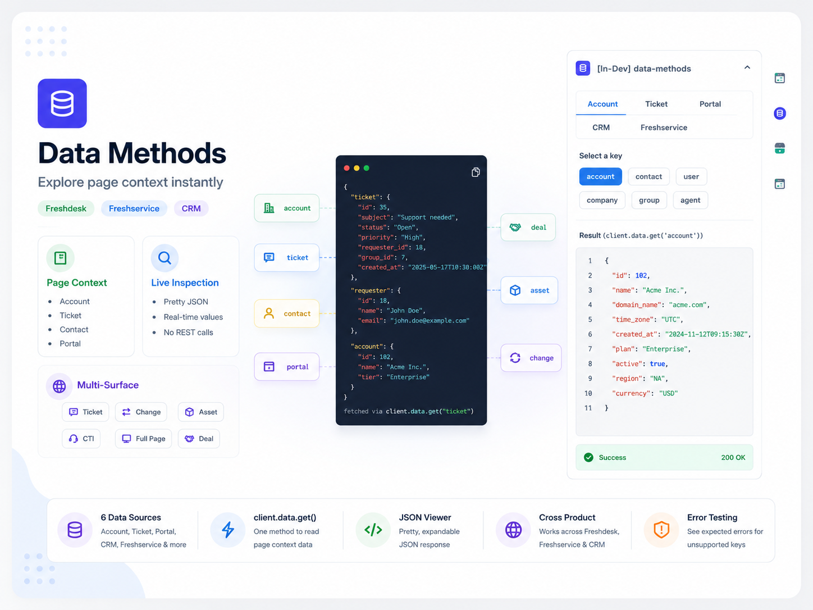

<p align="center">
  
</p>

# Data Method Samples — HealthFirst Data Playground

A Freshworks Platform 3.0 sample app that explores **`client.data.get()`** across Freshdesk, Freshservice, CRM, and common placeholders — reading page context without REST calls.

## Description

Agents and developers often need ticket, contact, and account context in the sidebar instantly. HealthFirst Data Playground maps one tabbed UI to every supported placeholder so you can click a data key, inspect JSON, and learn what works where — instead of guessing from documentation alone.

### Core Functionality

1. **Tabbed key browser** — Account, Ticket, Field options, Portal, Freshservice, and CRM tabs.
2. **Live JSON inspection** — each button calls `client.data.get(key)` and pretty-prints the response.
3. **Multi-surface deployment** — same playground HTML on ticket, contact, change, asset, CTI, full-page, and deal menu placeholders.
4. **Expected errors** — keys unavailable on the current page surface an error in the result panel (by design when exploring).

## User Interfaces

| Surface | Module / placement | Typical keys |
| --- | --- | --- |
| `app/views/playground.html` | `support_ticket.ticket_sidebar` | `ticket`, `requester`, `priority_options`, … |
| `app/views/playground.html` | `service_ticket.ticket_sidebar` | `ticket`, `currentHost`, … |
| `app/views/playground.html` | `support_contact.contact_sidebar` | `contact`, `company`, … |
| `app/views/playground.html` | `service_change.change_sidebar` | `change`, `currentHost` |
| `app/views/playground.html` | `service_asset.asset_sidebar` | `asset`, `currentHost` |
| `app/views/playground.html` | `service_user.contact_sidebar` | `department`, `currentHost` |
| `app/views/playground.html` | `common.full_page_app`, `cti_global_sidebar` | `loggedInUser`, `domainName`, `currentHost` |
| `app/views/playground.html` | `deal.deal_entity_menu` | `currentEntityInfo` |

## Platform 3.0 Features Used

### 1. Data Methods — Page Context

```javascript
const { ticket } = await client.data.get('ticket');
const { loggedInUser } = await client.data.get('loggedInUser');
const options = await client.data.get('priority_options');
```

Data is already loaded on the page — no separate API round trip.

### 2. Placeholder-Specific Availability

Each data key is only available on certain placeholders. The playground surfaces errors when a key is requested from the wrong page, teaching developers which keys work where.

### 3. Multi-Module Manifest

One manifest declares `support_ticket`, `service_ticket`, `support_contact`, `service_change`, `service_asset`, `service_user`, `deal`, and `common` modules so a single package installs across SKUs.

### 4. Crayons UI Components

| Component | Usage |
| --- | --- |
| `<fw-button>` | Data key trigger buttons per tab |
| `<fw-tabs>` | Account / Ticket / Field options / Portal / Freshservice / CRM |
| `<fw-label>` | JSON result panel headings |

Shared logic lives in `app/scripts/lib/data-playground.js`; entry script: `app/scripts/playground.js`.

## Project Structure

```
├── app/
│   ├── views/playground.html
│   ├── scripts/
│   │   ├── playground.js
│   │   └── lib/data-playground.js
│   └── styles/
│       ├── common.css
│       ├── playground.css
│       └── images/icon.svg
├── config/
│   └── iparams.json
├── manifest.json
├── usecase.md
└── README.md
```

## Prerequisites

- [Freshworks CLI (FDK)](https://developers.freshworks.com/docs/app-sdk/v3.0/support_ticket/basic-dev-tools/freshworks-cli/) v10.1.2 or later
- Node.js v24.x
- Trial accounts for the Freshworks products you want to explore

Enable global apps before local development:

```bash
fdk config set global_apps.enabled true
```

## Local Development

1. Clone the repository:
   ```bash
   git clone <repo-url>
   cd data-method-samples
   ```

2. Validate and run:
   ```bash
   fdk validate
   fdk run
   ```

3. Open the relevant product page with `?dev=true`, install the app, and open **HealthFirst Data Playground** from the sidebar, Apps menu, or CTI bar.

### Portal module note

FDK allows either an `app/` folder (agent surfaces) or a `visitor-app/` folder (end-user portal), not both in one package. This sample uses `app/` and declares `support_portal: {}` for multi-SKU installs. To run on a live portal page, adapt the playground into a `visitor-app/` layout.

## Key Learnings

1. **No REST for page context** — prefer `client.data.get()` for data already on the active page.
2. **`<field>_options` pattern** — dropdown values expose as `priority_options`, `status_options`, etc. on ticket pages.
3. **Placeholder matters** — register the app on the surface where the data key is documented; wrong placement returns errors.

## Resources

- [Data methods](https://developers.freshworks.com/docs/app-sdk/v3.0/common/client/data-method/)
- [Modular apps](https://developers.freshworks.com/docs/app-sdk/v3.0/common/modular-apps/)
