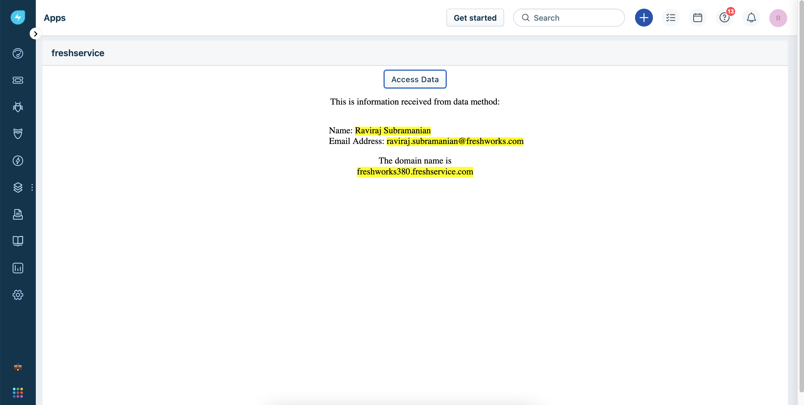
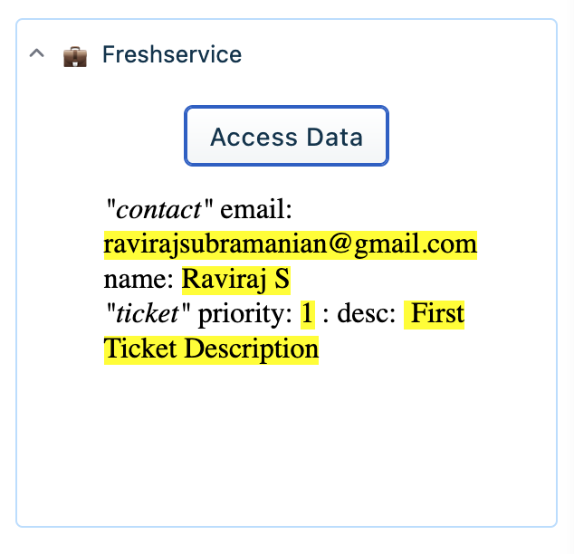

# Data Methods for freshservice

### Description:

Data Methods allow your app to access information on a given Freshservice page. In this tutorial you’ll learn how to consume data methods in your freshworks apps.

`client.data.get("<argument>")` returns a promise where your callback would have access data in the page which user is currently viewing.

### Screenshots:

#### Displaying Logged In User Data



#### Displaying Ticket and Requester Data



| Features demonstrated | Notes                                       |
| --------------------- | ------------------------------------------- |
| Data Methods          | Simply writes the information fetched to UI |

### Prerequisites:

1. Make sure you have a trial Freshservice account created. You can always [sign up](https://freshservice.com/signup)
2. Ensure that you have the [Freshworks CLI](https://community.developers.freshworks.com/t/what-are-the-prerequisites-to-install-the-freshworks-cli/234) installed properly.

### Procedure to run the app:

```sh
# Run the app
> fdk run
# app runs on localhost:10001 and sample config page is rendered on /custom_configs
```
